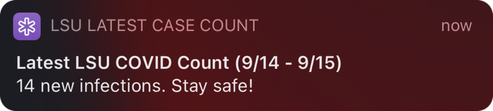

# LSU COVID-19 Count Notification Shortcut

This is an unofficial Apple Shortcuts script that scrapes [LSU Reveille's SEC COVID-19 Case Counts](https://www.lsureveille.com/coronavirus/sec-covid-19-case-counts/article_ebe622dc-0e60-11eb-81e3-57be2d1f234c.html) website and returns the latest COVID-19 case count. This shortcut can be used to send a daily notification through the automation section of Apple Shortcuts.

